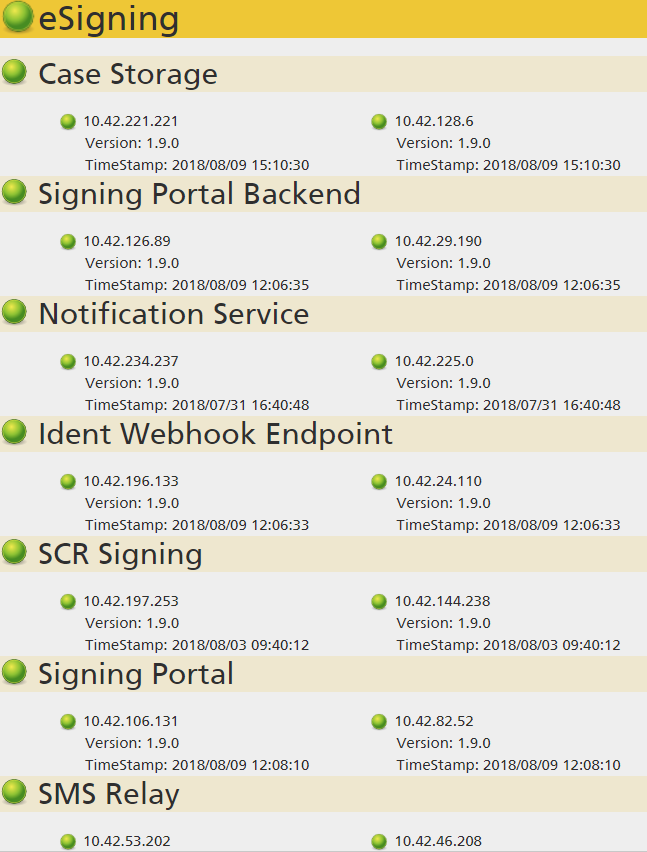
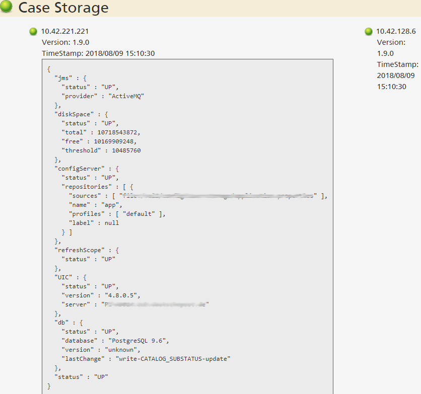

# Health Checks mit Spring Boot

Bei der Entwicklungen von Anwendungen in einer  Microservice Architektur  muss man mit wesentlich komplexeren 
Laufzeitumgebungen zurechtkommen als bei  monolithischen Anwendungen. Im Gegensatz zu einem Monolithen
kann eine Microservice Architektur nur in Teilen verfügbar sein. Continous Deployment einzelner Microservice
ührt dazu, dass es keine einheitliche Gesamtversion des Systems mehr gibt. Irgendwie muss man sich hier
Übersicht verschaffen. Wenn man das dann auch schon während der Entwicklung in den
Anfangs noch nicht so stabilen  Integrations- und Testsystemen schafft, vermeidet man viel Aufwand bei der Fehlerdiagnose.

Wir haben vor kurzem bei einem großen Kunden ein Projekt in Mikroservice-Architektur auf Basis von Spring Boot und Docker
in Produktion gebracht.  Zu Beginn der Entwicklung stellte man sich als Entwickler oft die Frage, ob 
die gerade gemachten Änderungen das System
unbrauchbar gemacht haben, oder ob das System einen teilweisen Ausfall hat, weil z.B. gerade ein anderer Service nicht 
starten will.  Bei einem klassichen Monolithen kann man
sich meistens auf der Maschine mit dem Applikationsserver einloggen und sich auf der Kommandozeile umsehen. Bei 20
Service Instanzen (wie bei unserem Projekt), die sich auf vier virtuellen Maschinen verteilen, lässt sich so nicht 
mehr effizient arbeiten. Hier muss automatisiert werden!
 
Neben einer zentralen Logfile Aggregation ist das automatische Einsammeln des Systemzustands wichtig. 
Wir haben dafür eine relativ einfache Lösung gefunden, die ich hier kurz skizzieren möchte.

## Netzwerkmonitoring
Netzwerkmonitoringsystem wie z.B. nagios sind die klassische Lösung, um den Gesamtzustand eines Systems abzufragen. Freie
System wie nagios haben allerdings Probleme mit der dynamischen Natur einer Microservce Architektur.
 Wir setzen in unserem Projekt ein kommerzielles Netzwerkmonitoringsystem ein, das mit den dynamischen
Aspekten umgehen kann. Allerdings hängen die Lizenzkosten von der Anzahl der zu überwachenden Server ab. Bei einer 
Microservice Architektur mit vielen Docker Container treibt dies den Preis steil nach oben, so dass nur die 
produktiven und produktionsnahen Umgebungen überwacht werden können. 

Wir wollten aber für unsere Integrations- und Entwicklungssysteme des Systemzustand erfassen. Spring Boot  
hat einen eingebauten Diagnosemechanismus, den man dazu benutzen kann.

	
##Spring Actuator Endpoints
 
Mit den Spring Boot Actuator Endpoints (siehe 
<https://docs.spring.io/spring-boot/docs/2.0.4.RELEASE/reference/htmlsingle/#production-ready> ) bietet Spring Boot
eine REST-Api an, mit der sich zahlreiche Informationen einer Spring Boot Applikation abfragen lassen. Es lassen
sich z.B. 
- Alle Konfigurationswerte
- Die letzten HTTP-Requests
- Mapping der REST-Endpunkte
- Session Store
- Tasks im Scheduler

und vieles mehr abfragen.
Im folgenden geht es um die Endpunkte `health` und `info`.  

In produktiven Systemen darf man nicht vergessen, die Actuator Endpoints abzusichern. Das heißt es sollten in der
Konfiguration als Default alle Endpunkte abgeschaltet werden und nur die wirklich benötigten explizit eingeschaltet
werden. Über Spring Security muss dannd er Zugriff auf die freigeschalteten Endpunkte abgesichert werden.

### Der Health Endpunkt
Der `/health` Endpunkt liefert Basisinformationen zum Gesundheitszustand eines Microservices. Standardmäßig liefert Spring 
Boot Informationen zum Festplattenplatz und zu benutzten Datenbanken und JMS-Servern. Man kann aber sehr einfach neue 
Checks hinzufügen, indem man Komponenten schreibt, die das `HealthIndicator` Interface implementieren.
Das folgende Beispiel prüft, ob sich ein externer REST-Service erreichen lässt:
	
	
    @Component
    public class UICHealthIndicator implements HealthIndicator {
    
        // Client für UIC Restaufrufe
        private final UicClient uicClient;
    
        @Autowired
        public UICHealthIndicator(UicClient uicClient) {
            this.uicClient = uicClient;
        }
    
        @Override
        public Health health() {
            try {
                // UIC gibt seinen Status über den REST-Endpunkt /systemInfo Preis
                Systeminformation result = uicClient.systemInfo();
                return Health.up()
                        .withDetail("version", result.getVersion())
                        .withDetail("server", result.getServer())
                        .build();
            } catch (Exception e) { 
                return Health.down().withDetail("reason", e.getMessage()).build();
            }
        }
    }

Wenn man möchte, kann man jede externe Abhängikeit seines Microservices einen Test schreiben. Beispiele für solche Tests sind:
- Funktionsfähigkeit von beutzten REST- oder Web-Services
- Erreichbarkeit sonstiger externer URLs
- Überprüfung von gemounteten Dateisystemen. Man kann hier prüfen, ob die erwarteten Dateien und Verzeichnisse tatsächlich 
vorhanden sind und ob die Zugriffsrechte stimmen.
- Versionsstand der Datenbank. Im Falle von Liquibase kann man z.B. mit einer Datenbankquery über die Tabelle `databasechangelog` 
den Namen und den Status des zuletzt ausgeführten Datenbankskripts abfragen.

### Der Info Endpunkt
Der Info Endpoint (/info) gibt alle Konfigurationswerte mit dem Prefix info. zurück. Mit ihm lassen sich sehr gut Informationen aus dem Buildprozess (z.B. eine Versionsnummer 
und das Builddatum) verfügbar machen. Wenn man Maven verwendet und die Variablenersetzung für Properties-Dateien einschaltet, führt ein Einträge wie z.B.:

            info.build.artifact=@project.artifactId@
            info.build.version=@project.version@
            info.build.timestamp=@build.time@
            
dazu, dass später im laufenden Programm der Infoendpoint den Namen des Maven-Moduls, die aktuelle Versionsnummer und den Zeitpunkt des Builds zurückliefert. 
	
## Übersicht schaffen
Mit den /health und /info Endpunkten kann man jetzt jeden einzelnen Mikroservice abfragen und erhält jeweils eine Antwort im JSON-Format. Schöner ist es natürlich, 
wenn man einen Endpunkt hat, der die Health und Info Daten aller Microservices abfragt und zusammenfasst. In unserem Projekt haben wir dazu einen eigenen Rest-Endpunkt 
implementiert, der die Namen und Zugangsdaten (URL, Benutzername, verschlüsseltes Passwort) aller Microservices aus einer Konfigurationsdatei liest und dann bei einem Aufruf 
Reihe nach abarbeitet. Aus den einzelnen JSON-Antworten erstellt dieser neue Aggregator Endpunkt eine aggregierte Gesamtantwort im JSON Format. Wir haben dann noch
eine Webseite geschrieben, die diese Gesamtantwort optisch ansprechend darstellt.
Bei der Implementierung eines solchen Aggregator Services sollte man versuchen, dass in einem Cluster jede einzelne Instanz eines Services abgefragt wird. Es hängt dabei
von der Dockerlaufzeitumgebung und der verwendeten Loadbalancer ab, wie man die einzelnen Instanzen addressieren kann. In unserem Fall verwendet die Laufzeitumgebung
ein DNS basiertes Verteilungsverfahren. Das heißt jeder Service hat einen eigenen Servernamen, der auf mehrere IP-Adressen aufgelöst wird. Wenn man die DNS Auflösung von Hand
ausführt, erhhält man dann ein Array mit IP-Adressen, die man dann einzeln abfragen kann. 
Wenn man den Rest-Endpunkt als Unterklasse von org.springframework.boot.actuate.endpoint.AbstactEndpoint implementiert wird er als Spring Boot Actuator 
Endpunkt registriert. Das bedeutet, dass die Spring Boot Konfiguration für Actuator Endpunkte (Authentisierung, Autoriserung, Ein- und Ausschalten) auch
für den selbst geschriebenen Endpunkt gilt.
Bei uns sieht das Endergebnis als Webseite so aus:

Für jeden einzelnen Knoten lassen sich die Details im JSON-Format anzeigen:

 

## In der praktischen Anwendung
In der Praxis ist die Health-Übersichtsseite immer die erste Anlaufstelle, wenn man den Systemzustand abfragen möchte. Die 
Seiten der einzelnen System lassen sich blitzschnell über Browserbookmarks ansprechen. Im Gegensatz dazu, brauche ich in der Weboberfläche 
des Buildservers sieben Clicks (keine Bookmarks möglich) und für die reguläre Systemüberwachung muss ich erst eine Desktopapplikation
starten und mich dort anmelden. Bei einem Deployment lässt sich über die Health-Seite am schnellsten prüfen, ob die neuen 
Version deployed wurden (Builddatum und Versionsnummer) und ob der neuen Service betriebsbereit ist. Erst wenn in der 
Health-Seite etwas nicht stimmt, wendet man sich den Spezialwerkzeugen zu. 
Da die Health-Seite einfach aufgebaut ist, kann man sie auch Product Ownern oder Testern an die Hand geben. Das
Entwicklungsteam muss dann mit deutlich weniger Fragen zum Systemzustand beantworten. Wenn ein externer Testservice nicht 
zur Verfügung steht kann das jetzt jeder selbst abfragen.  

Gerade am Anfang des Projekts, wenn sowohl die eigene Software als auch die Infrastruktur (Containermanagement, Loadbalancer, 
Firewalls, etc.) noch nicht stabil sind, hilft eine solche Seite bei der schnellen Problemanalyse. Falsch konfigurierte 
Passwörter oder Loadbalancer, die auf eine falsche Maschine umleiten, lassen sich so schnell erkennenn. 